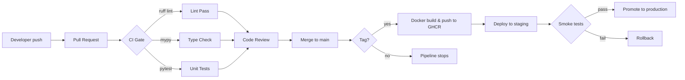

# CI/CD Pipeline

```mermaid
flowchart LR
    DEV[Developer push] --> PR[Pull Request]
    PR --> CI{CI Gate}
    CI -->|ruff lint| L[Lint Pass]
    CI -->|mypy| T[Type Check]
    CI -->|pytest| U[Unit Tests]
    L & T & U --> REVIEW[Code Review]
    REVIEW --> MERGE[Merge to main]
    MERGE --> TAG{Tag?}
    TAG -- yes --> DOCKER[Docker build & push to GHCR]
    TAG -- no --> SKIP[Pipeline stops]
    DOCKER --> DEPLOY[Deploy to staging]
    DEPLOY --> SMOKE{Smoke tests}
    SMOKE -- pass --> PROD[Promote to production]
    SMOKE -- fail --> ROLLBACK[Rollback]
```

Workflows:
- `.github/workflows/ci.yml` — on every push: lint, type-check, unit tests.
- `.github/workflows/docker-publish.yml` — on tag `v*.*.*`: build and push container.
