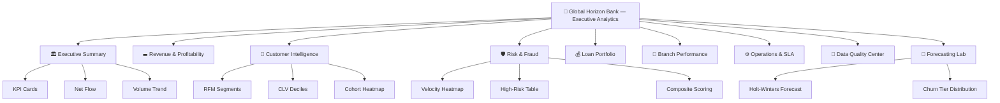

# Executive Dashboard Navigation

```mermaid
flowchart TD
    HOME[🏦 Global Horizon Bank — Executive Analytics] --> T1[🏛️ Executive Summary]
    HOME --> T2[💵 Revenue & Profitability]
    HOME --> T3[👥 Customer Intelligence]
    HOME --> T4[🛡️ Risk & Fraud]
    HOME --> T5[💰 Loan Portfolio]
    HOME --> T6[🏢 Branch Performance]
    HOME --> T7[⚙️ Operations & SLA]
    HOME --> T8[🧪 Data Quality Center]
    HOME --> T9[🔮 Forecasting Lab]

    T1 --> K1[KPI Cards]
    T1 --> K2[Net Flow]
    T1 --> K3[Volume Trend]

    T3 --> R1[RFM Segments]
    T3 --> R2[CLV Deciles]
    T3 --> R3[Cohort Heatmap]

    T4 --> F1[Velocity Heatmap]
    T4 --> F2[High-Risk Table]
    T4 --> F3[Composite Scoring]

    T9 --> H1[Holt-Winters Forecast]
    T9 --> H2[Churn Tier Distribution]
```
