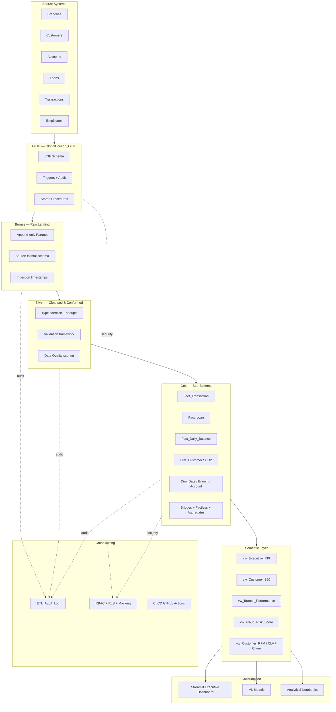

# Enterprise Architecture Diagram

```mermaid
flowchart TB
    subgraph Sources [Source Systems]
        S1[Branches]
        S2[Customers]
        S3[Accounts]
        S4[Loans]
        S5[Transactions]
        S6[Employees]
    end

    subgraph OLTP [OLTP — GlobalHorizon_OLTP]
        O1[3NF Schema]
        O2[Triggers + Audit]
        O3[Stored Procedures]
    end

    subgraph Bronze [Bronze — Raw Landing]
        B1[Append-only Parquet]
        B2[Source-faithful schema]
        B3[Ingestion timestamps]
    end

    subgraph Silver [Silver — Cleansed & Conformed]
        SI1[Type coercion + dedupe]
        SI2[Validation framework]
        SI3[Data Quality scoring]
    end

    subgraph Gold [Gold — Star Schema]
        G1[Fact_Transaction]
        G2[Fact_Loan]
        G3[Fact_Daily_Balance]
        G4[Dim_Customer SCD2]
        G5[Dim_Date / Branch / Account]
        G6[Bridges + Factless + Aggregates]
    end

    subgraph Semantic [Semantic Layer]
        V1[vw_Executive_KPI]
        V2[vw_Customer_360]
        V3[vw_Branch_Performance]
        V4[vw_Fraud_Risk_Score]
        V5[vw_Customer_RFM / CLV / Churn]
    end

    subgraph Consumption [Consumption]
        C1[Streamlit Executive Dashboard]
        C2[ML Models]
        C3[Analytical Notebooks]
    end

    Sources --> OLTP --> Bronze --> Silver --> Gold --> Semantic --> C1
    Semantic --> C2
    Semantic --> C3

    subgraph Cross [Cross-cutting]
        X1[ETL_Audit_Log]
        X2[RBAC + RLS + Masking]
        X3[CI/CD GitHub Actions]
    end

    Bronze -.audit.-> X1
    Silver -.audit.-> X1
    Gold   -.audit.-> X1
    OLTP   -.security.-> X2
    Gold   -.security.-> X2
```
