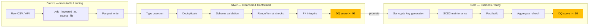

# Medallion Data Flow

```mermaid
flowchart LR
    subgraph BRONZE [Bronze — Immutable Landing]
        B1[Raw CSV / API]
        B2[Add _ingested_at, _source_file]
        B3[Parquet write]
    end

    subgraph SILVER [Silver — Cleansed & Conformed]
        S1[Type coercion]
        S2[Deduplicate]
        S3[Schema validation]
        S4[Range/format checks]
        S5[FK integrity]
        S6[DQ score >= 95]
    end

    subgraph GOLD [Gold — Business-Ready]
        G1[Surrogate key generation]
        G2[SCD2 maintenance]
        G3[Fact build]
        G4[Aggregate refresh]
        G5[DQ score >= 99]
    end

    B1 --> B2 --> B3 --> S1 --> S2 --> S3 --> S4 --> S5 --> S6
    S6 -- promote --> G1 --> G2 --> G3 --> G4 --> G5

    classDef gate fill:#FFC107,stroke:#FF8F00,color:#000
    class S6,G5 gate
```

**DQ gates** (highlighted) prevent low-quality data from polluting downstream zones.
