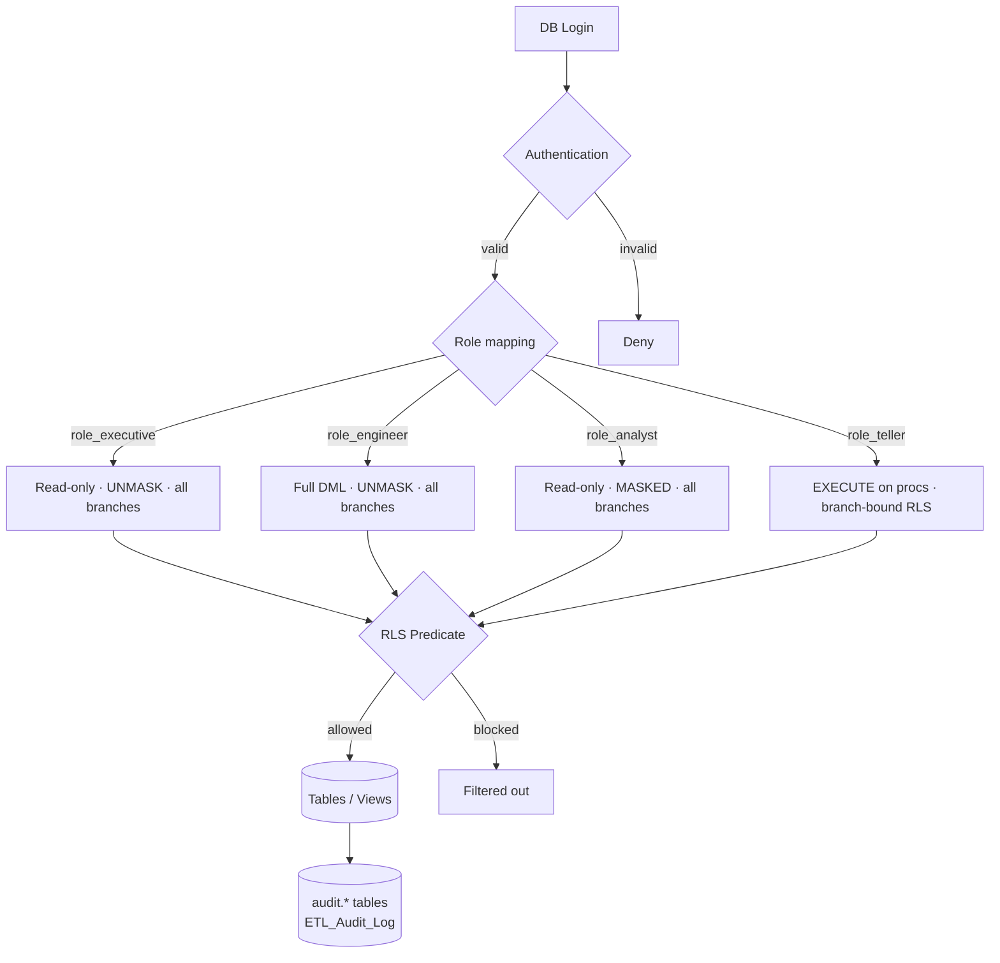

# Security Access Model

**Key controls**
- RLS: `rls.fn_BranchAccessPredicate` enforces branch boundary for tellers.
- Masking: Email, Phone, Address have dynamic data masks applied; analyst role does not have UNMASK.
- Audit: every DML on `Accounts` and `Transactions` is captured by triggers.
