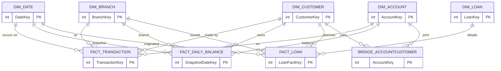

# Star Schema — Global Horizon DWH

```mermaid
erDiagram
    DIM_DATE ||--o{ FACT_TRANSACTION   : "occurs on"
    DIM_DATE ||--o{ FACT_DAILY_BALANCE : "snapshot"
    DIM_DATE ||--o{ FACT_LOAN          : "originated"

    DIM_CUSTOMER ||--o{ FACT_TRANSACTION   : "made by"
    DIM_CUSTOMER ||--o{ FACT_DAILY_BALANCE : "owns"
    DIM_CUSTOMER ||--o{ FACT_LOAN          : "borrows"

    DIM_BRANCH ||--o{ FACT_TRANSACTION   : "at"
    DIM_BRANCH ||--o{ FACT_DAILY_BALANCE : "branch"
    DIM_BRANCH ||--o{ FACT_LOAN          : "issued"

    DIM_ACCOUNT ||--o{ FACT_TRANSACTION   : "on"
    DIM_ACCOUNT ||--o{ FACT_DAILY_BALANCE : "balance"

    DIM_LOAN     ||--o{ FACT_LOAN : "details"

    DIM_CUSTOMER ||--o{ BRIDGE_ACCOUNTCUSTOMER : "joint"
    DIM_ACCOUNT  ||--o{ BRIDGE_ACCOUNTCUSTOMER : "joint"

    DIM_DATE     { int DateKey PK }
    DIM_CUSTOMER { int CustomerKey PK }
    DIM_BRANCH   { int BranchKey PK }
    DIM_ACCOUNT  { int AccountKey PK }
    DIM_LOAN     { int LoanKey PK }

    FACT_TRANSACTION   { int TransactionKey PK }
    FACT_DAILY_BALANCE { int SnapshotDateKey PK }
    FACT_LOAN          { int LoanFactKey PK }

    BRIDGE_ACCOUNTCUSTOMER { int AccountKey PK }
```
