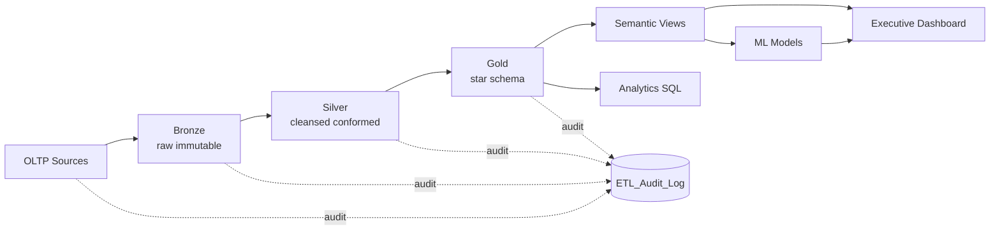

# Architecture — Global Horizon Bank Enterprise Data Platform

This document describes the layered architecture of the Global Horizon Bank Enterprise Data Warehouse Platform: how data flows from operational systems through a medallion lakehouse into a star-schema warehouse, a semantic layer, and finally to executive analytics and ML models.

---

## 1. Architectural Principles

| Principle | Realization |
|---|---|
| **Separation of concerns** | OLTP for transactions, OLAP for analytics — never mix |
| **Single source of truth** | Gold-zone star schema is the canonical analytical surface |
| **Idempotency** | Every ETL step can re-run safely; dimensions de-duplicate by business key |
| **Observability** | All pipeline steps emit audit rows with timestamps, row counts, DQ scores |
| **Defense in depth** | RBAC at DB level, RLS for branch-bound users, masking for PII |
| **Performance by design** | Columnstore on facts, partitioning on date, covering indexes |
| **Reproducibility** | Seeded data generation, Docker parity, CI checks |

---

## 2. Layer Reference

### 2.1 Source Systems (OLTP)
- `GlobalHorizon_OLTP` — fully normalized 3NF database.
- Tables: `Customers`, `Branches`, `Employees`, `Accounts`, `Loans`, `Transactions`, `Account_Customers`.
- Constraints: PKs, FKs, CHECK, UNIQUE.
- Triggers: `tr_Accounts_Audit`, `tr_Transactions_Audit`, `tr_Transactions_AccountStatusGuard`.
- Stored Procedures: `usp_TransferFunds` (deadlock-safe retry), `usp_OpenAccount`, `usp_PostTransaction`.
- Audit schema: `audit.AccountChanges`, `audit.TransactionLog`.

### 2.2 Bronze Zone — Raw Landing
- **Purpose:** Immutable, append-only copy of source data.
- **Format:** Parquet (CSV fallback). Adds `_ingested_at` and `_source_file`.
- **Module:** `src/etl/bronze.py`.
- **DQ Gate:** Schema-only (column presence).

### 2.3 Silver Zone — Cleansed & Conformed
- **Purpose:** Type-coerced, deduplicated, validated, quality-scored data.
- **Module:** `src/etl/silver.py`.
- **Validation:** Schema, nulls, uniqueness, ranges, FK integrity.
- **DQ Gate:** Score ≥ 95 to promote to Gold.

### 2.4 Gold Zone — Star Schema
- **Purpose:** Business-ready dimensional model.
- **Module:** `src/etl/gold.py` (Python) and `sql/etl/01_etl_procedures.sql` (T-SQL).
- **Facts:** `Fact_Transaction`, `Fact_Daily_Balance`, `Fact_Loan`.
- **Dimensions:** `Dim_Date`, `Dim_Customer` (SCD2), `Dim_Account`, `Dim_Branch`, `Dim_Loan`, `Dim_Junk_TxnFlags`.
- **Bridges:** `Bridge_AccountCustomer`.
- **Factless:** `Factless_BranchVisit`.
- **Aggregates:** `Agg_Branch_Monthly`, `Agg_Customer_Annual`.

### 2.5 Semantic Layer
- Business-facing views in `sql/olap/06_views_semantic_layer.sql`.
- Examples: `vw_Executive_KPI`, `vw_Branch_Performance`, `vw_Customer_360`, `vw_Monthly_Trend`, `vw_Loan_Portfolio`.

### 2.6 Analytics Layer
- Specialized analytical scripts in `sql/analytics/`:
  - `01_fraud_detection.sql` — velocity, structuring, z-score, composite risk.
  - `02_churn_cohort.sql` — churn tiers, cohort retention, recursive CTEs.
  - `03_customer_lifetime_value.sql` — RFM scoring + 24-month CLV projection.
  - `04_branch_benchmarking.sql` — efficiency frontier and league tables.
  - `05_anomaly_detection.sql` — rolling z-score anomalies.

### 2.7 ML / AI Layer
- Models in `src/ml/`:
  - `churn_model.py` — Gradient Boosting churn classifier.
  - `default_model.py` — Loan default classifier.
  - `fraud_model.py` — Isolation Forest anomaly detector.
  - `segmentation.py` — K-Means RFM segmentation + NBO.
  - `forecast.py` — Holt-Winters branch revenue forecasts.

### 2.8 Consumption
- **Streamlit Executive Dashboard** — `dashboard/app_executive.py` (9 tabs).
- **Notebooks / SQL Editors** — direct semantic-layer view access.
- **Downstream APIs** — semantic views are stable contracts.

### 2.9 Audit & Lineage
- `dbo.ETL_Audit_Log` — every pipeline step writes start, end, rows, status, DQ score.
- Source-file timestamps in Bronze provide forensic lineage.

---

## 3. Data Flow Diagram



---

## 4. Non-Functional Requirements

| NFR | Target | Mechanism |
|---|---|---|
| Dashboard query latency | < 1.5 s (P95) | Aggregates + columnstore |
| Pipeline freshness | < 4 h after source mutation | Incremental `sp_ETL_Fact_Transaction` |
| Data quality | Gold ≥ 99 | Validation framework + DQ gate |
| Recovery time objective | < 4 h | Nightly DB backups + scripted re-bootstrap |
| Audit retention | 7 years | Audit schema partitioning (roadmap item) |

---

## 5. Deployment Topology

```
[ Developers ] ──> GitHub Actions ──> Container Registry (GHCR)
                                            │
                                            ▼
                              [ Production Container Host ]
                                            │
                  ┌─────────────────────────┼─────────────────────────┐
                  ▼                         ▼                         ▼
          [ SQL Server 2022 ]      [ Streamlit App ]           [ ML Workers ]
          (DWH + OLTP)             (executive dashboard)       (scheduled jobs)
```

See [`runbook.md`](runbook.md) for operational procedures.
