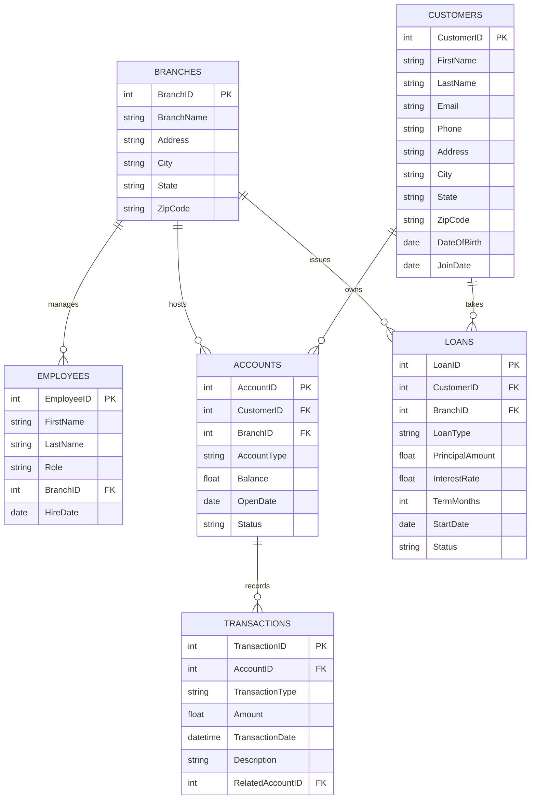

# 📊 Data Model Previews

Since `.drawio` files cannot be rendered directly in Markdown viewers (like GitHub or standard VS Code), here are the visual representations of your data models.

## 1. OLTP System (Transactional)
This model represents the operational banking system.

---

## 2. OLAP Data Warehouse (Star Schema)
This model represents the analytical data warehouse optimized for reporting.

```mermaid
erDiagram
    FACT_TRANSACTION }|--|| DIM_DATE : "at"
    FACT_TRANSACTION }|--|| DIM_CUSTOMER : "by"
    FACT_TRANSACTION }|--|| DIM_BRANCH : "from"
    FACT_TRANSACTION }|--|| DIM_ACCOUNT : "on"

    FACT_TRANSACTION {
        int TransactionKey PK
        int TransactionID
        int DateKey FK
        int CustomerKey FK
        int AccountKey FK
        int BranchKey FK
        string TransactionType
        float Amount
    }

    DIM_CUSTOMER {
        int CustomerKey PK
        int CustomerID
        string FirstName
        string LastName
        string AgeGroup
        string City
        string State
        date EffectiveDate
        date ExpirationDate
        boolean IsCurrent
    }

    DIM_DATE {
        int DateKey PK
        date FullDate
        int Year
        int Quarter
        int Month
        int DayOfMonth
        string DayOfWeek
    }

    DIM_BRANCH {
        int BranchKey PK
        int BranchID
        string BranchName
        string City
        string State
        string ZipCode
    }

    DIM_ACCOUNT {
        int AccountKey PK
        int AccountID
        string AccountType
        date OpenDate
        string Status
    }
```

> [!IMPORTANT]
> **GitHub Visibility**: Standard Markdown viewers (including GitHub) cannot render `.drawio` files as images. 
> To fix the broken images in your `README.md`, you should:
> 1. Open the `.drawio` files in [draw.io](https://app.diagrams.net/).
> 2. Export them as **PNG** or **SVG**.
> 3. Save them in the `diagrams/` folder as `oltp_erd.png` and `olap_erd.png`.
> 4. Update the `README.md` to point to these new image files.
